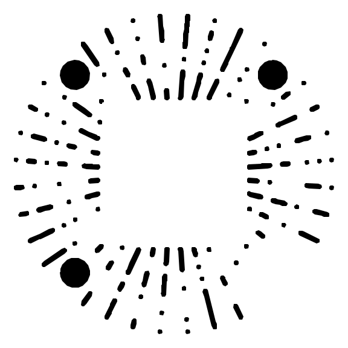

# 支持项目 / Support This Project

如果我的项目对你有帮助，欢迎点一个 Star，这已经是很大的支持。  
如果你愿意进一步支持项目维护，也可以通过下方赞赏码请作者续一口 AI 订阅。

## 为什么需要赞赏？

众所周知，风水宝地土耳其并非久居之所。  
账号颠沛流离，订阅价格高昂，而开发、测试、维护、修 bug、写文档都需要时间和精力。

你的赞赏不会改变任何项目的开源属性，也不是购买服务。  
它更像是对项目维护的一点鼓励，让作者在面对订阅账单时少一些沉默，多一些更新动力。

## 赞赏可以带来什么？

赞赏后，你将获得：

- 作者诚挚且发自内心的感谢
- 项目更快、更稳定更新的概率提升
- 对合理功能建议的优先考虑
- 对小型定制需求更积极的响应
- 以及一份“这个项目居然真的有人支持”的精神 buff

当然，即使不赞赏，也完全不影响你正常使用项目、提交 Issue、提出建议。  
如果需求合理，作者通常也不会拒绝帮忙。

不过——  
如果这些项目真的帮到了你，你真的忍心让作者独自面对昂贵的订阅账单吗 😢

## 赞赏方式

可通过下方赞赏码支持项目维护：

  

> 赞赏完全自愿，不构成购买、雇佣、付费支持或商业服务承诺。  
> 项目仍按照原有开源协议发布和维护。

## 联系方式

- 酷安主页：[V0idream / Eternight](https://www.coolapk.com/u/3597697)
- 邮箱：[v0idream@163.com](mailto:v0idream@163.com)
